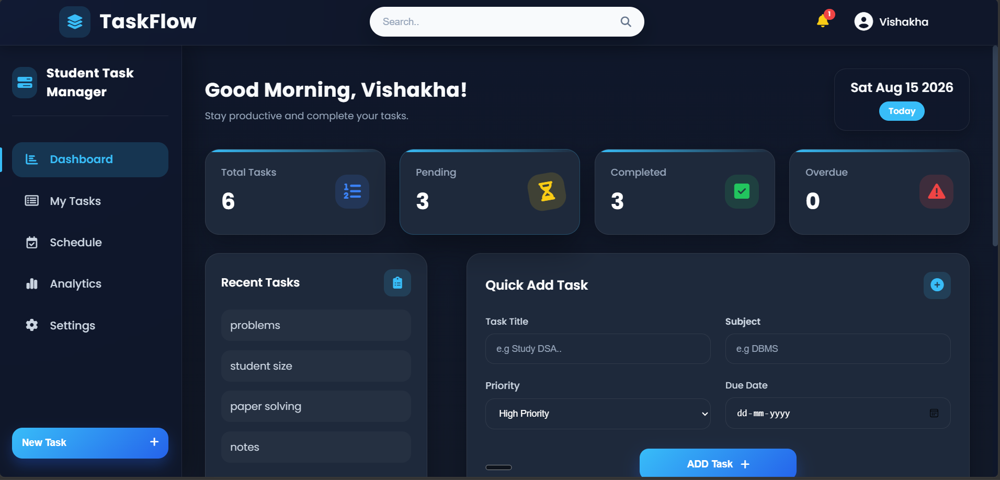
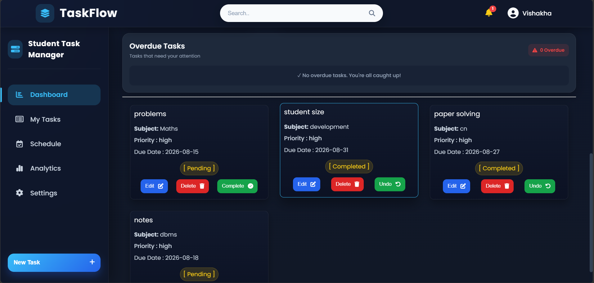
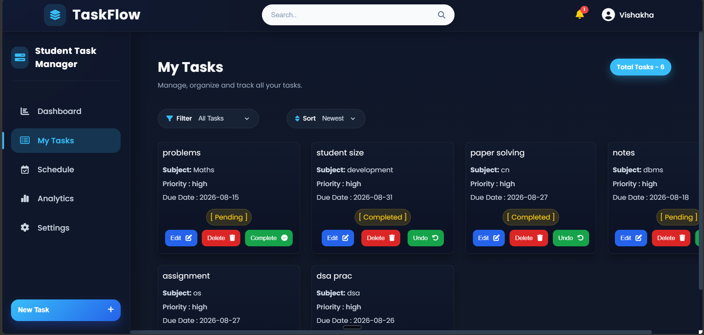
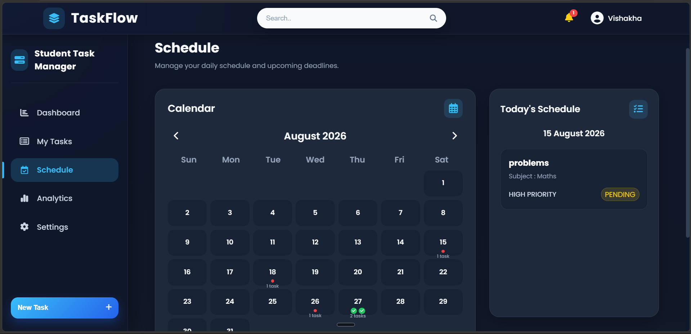
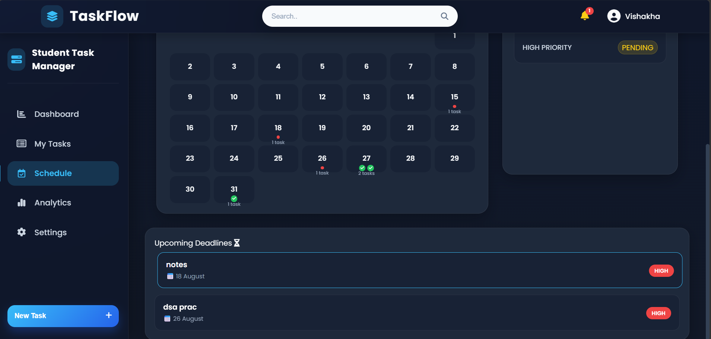
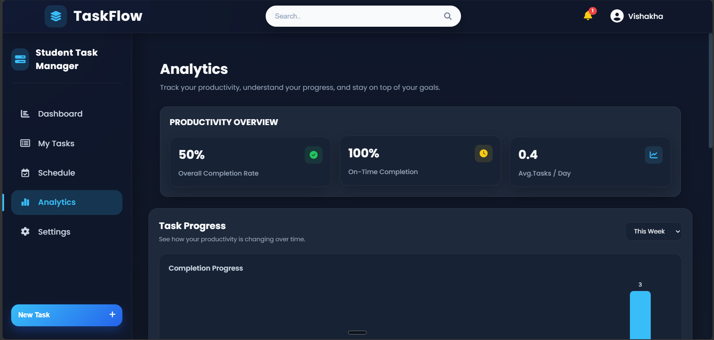
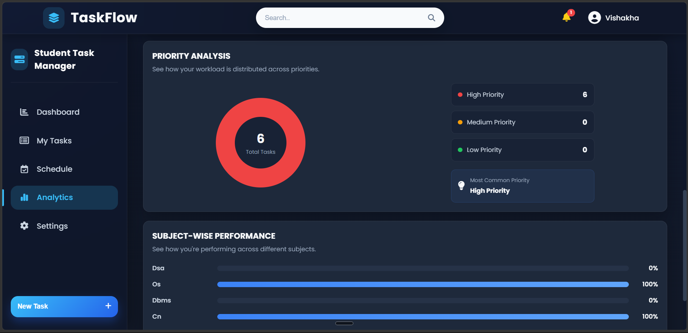
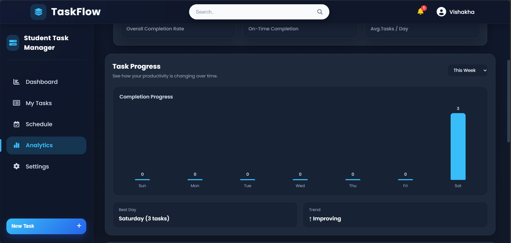
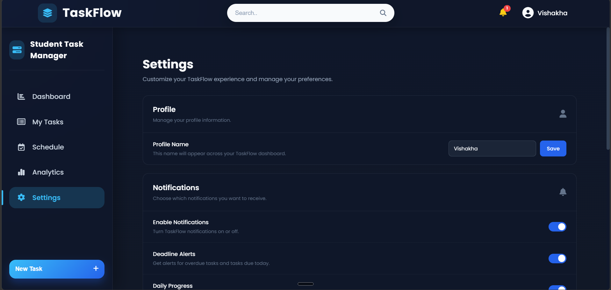
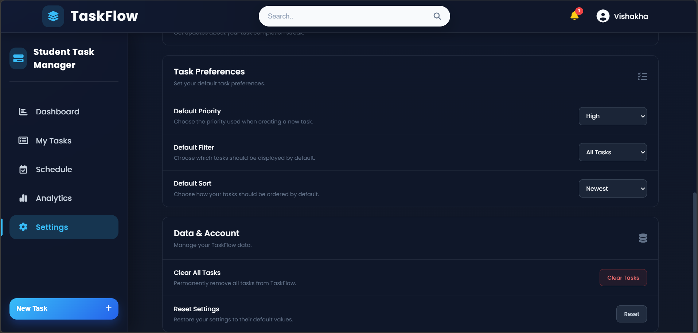

# 📚 TaskFlow — Student Task Manager

> **A modern, responsive task management dashboard designed to help students organize tasks, manage deadlines, track productivity, and stay consistent with their goals.**

## ✨ Overview

**TaskFlow** is a student-focused task management web application built to make everyday academic planning simpler and more organized.

It combines task management, scheduling, productivity analytics, notifications, and customizable preferences into a single responsive dashboard.

The project focuses on creating a **clean UI + practical JavaScript functionality**, rather than being just a static frontend design.

---

## 🚀 Features

### 🏠 Dashboard

* Personalized greeting
* Current date display
* Task statistics
* Recent tasks
* Quick task creation
* Overdue task section
* Responsive dashboard layout

### ✅ Task Management

* Create new tasks
* Set task subjects
* Assign priorities
* Set due dates
* Mark tasks as completed
* Undo completed tasks
* Delete tasks
* View all tasks in one place

### 📅 Schedule

* Interactive monthly calendar
* Previous/next month navigation
* Task indicators on calendar dates
* Priority-based task indicators
* Green check indicator for completed tasks
* Today's schedule
* Upcoming deadlines

### 📊 Analytics

* Overall completion rate
* On-time completion rate
* Average tasks completed per day
* Task progress visualization
* Best productivity day
* Productivity trend
* Priority distribution
* Subject-wise performance
* Best-performing subject

### 🔔 Notifications

* Task-related notifications
* Deadline alerts
* Notification counter
* Notification panel
* Clear notifications option

### ⚙️ Settings

* Profile name customization
* Notification preferences
* Deadline alerts
* Daily progress notifications
* Daily streak notifications
* Default task priority
* Default task filter
* Default task sorting
* Clear all tasks
* Reset settings

### 📱 Responsive Design

TaskFlow is designed to adapt to:

* 💻 Desktop
* 🖥️ Large screens
* 📱 Tablets
* 📱 Mobile devices
* 📱 Small mobile screens

---

## 🎨 UI Highlights

* Modern dark-themed interface
* Card-based dashboard
* Smooth hover effects
* Responsive layouts
* Consistent color system
* Interactive controls
* Subtle animations
* Clean typography
* Mobile-friendly navigation

---

## 🛠️ Technologies Used

| Technology        | Usage                                |
| ----------------- | ------------------------------------ |
| **HTML5**         | Website structure                    |
| **CSS3**          | Styling, layouts & responsive design |
| **JavaScript**    | Task management & application logic  |
| **Font Awesome**  | Icons                                |
| **Local Storage** | Persistent task & preference data    |

---

## 📂 Project Structure

```text
TaskFlow/
│
├── index.html
├── style.css
├── script.js
│
├── images/
│
└── README.md
```


---

## 💾 Data Persistence

TaskFlow uses **browser Local Storage** to preserve application data.

This allows tasks and user preferences to remain available even after refreshing or reopening the website in the same browser.

No external database is required for the current version.

---

## 🧠 What I Learned

Building TaskFlow helped me practice and strengthen:

* DOM manipulation
* JavaScript event handling
* Arrays and objects
* Dynamic HTML generation
* Local Storage
* Date handling
* Filtering and sorting
* Responsive CSS
* CSS Grid & Flexbox
* UI/UX design
* Component-like UI organization
* Managing state in a frontend application
* Debugging and testing
* Building a complete project from scratch

---

## 🔮 Future Improvements

Possible future versions could include:

* 🔐 User authentication
* ☁️ Cloud database synchronization
* 📱 Progressive Web App support
* ⏰ Browser push notifications
* 🎯 Goal tracking
* 📈 More advanced analytics
* 🏆 Gamification and achievement system
* 🌙 Theme customization
* 🔄 Multi-device synchronization

---

## 📸 Screenshots

### Dashboard



### My Tasks


### Schedule



### Analytics




### Settings


---

## 🌐 Live Demo

🔗 **Live Demo:** taskflow-studenttaskmanager.netlify.app

---

## 👩‍💻 Author

**Vishakha Kadam**

Computer Engineering Student | Frontend & Java Developer

### Connect with me

* 💻 GitHub: https://github.com/vishakha2609
* 🌐 Portfolio: https://vishakhaportfolio1.netlify.app/
* 💼 LinkedIn: https://www.linkedin.com/in/vishakha-kadam-433a65330

---

## ⭐ Support

If you found **TaskFlow** useful or interesting, consider giving the repository a ⭐ on GitHub!

---

<p align="center">
  Made with ❤️ using HTML, CSS & JavaScript
</p>
